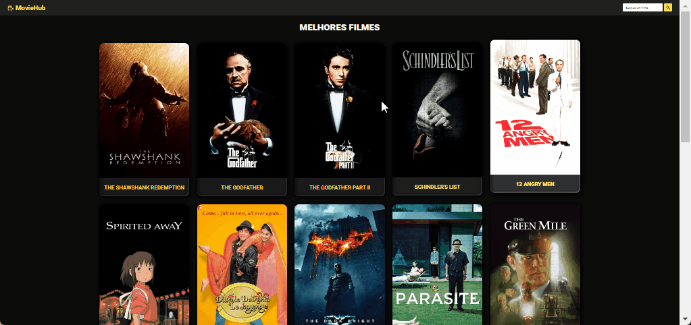

# 🎥 MovieHub

**MovieHub** é um projeto de uma biblioteca de filmes criada com React e integração com a API do TMDB (The Movie Database). Este projeto permite aos usuários visualizar uma lista de filmes e pesquisar filmes específicos.



## 🚀 Funcionalidades

- Exibição de uma biblioteca de filmes.
- Pesquisa de filmes usando a API do TMDB.
- Visualização de detalhes de cada filme, incluindo a tagline, orçamento, receita, duração e descrição.

## 📋 Pré-requisitos

Antes de começar, verifique se você possui [Node.js](https://nodejs.org/) instalado em sua máquina.

## 🔧 Instalação

1. Clone o repositório para o seu ambiente local:
   ```bash
   git clone https://github.com/ErosNetto/MovieHub.git
   ```
2. Navegue até o diretório do projeto:

   ```bash
   cd movie_hub
   ```

3. Instale as dependências:
   ```bash
   npm install
   ```
4. Crie um arquivo .env na raiz do projeto e adicione suas variáveis de ambiente:
   ```bash
   VITE_API_KEY=suaChaveDaApiTMDB
   VITE_API=https://api.themoviedb.org/3/movie/
   VITE_SEARCH=https://api.themoviedb.org/3/search/movie
   VITE_IMG=https://image.tmdb.org/t/p/w500/
   ```
5. Inicie o servidor de desenvolvimento:
   ```bash
   npm run dev
   ```
6. Acesse o aplicativo no seu navegador.

## 🛠️ Tecnologias Utilizadas

- **[React](https://reactjs.org/)** - Uma biblioteca JavaScript para construção de interfaces de usuário.
- **[React Router](https://reactrouter.com/)** - Uma biblioteca que permite a navegação entre diferentes componentes em aplicações React.
- **[React Icons](https://react-icons.github.io/react-icons/)** - Uma coleção de ícones SVG que podem ser facilmente integrados ao seu projeto React.
- **[CSS](https://www.w3schools.com/css/)** - Para estilização e layout da aplicação.
- **[TMDB API](https://developers.themoviedb.org/3)** - API para acesso a informações sobre filmes, séries e outros conteúdos relacionados.

## 🖇️ Contribuições

Contribuições são sempre bem-vindas! Se você gostaria de ajudar a melhorar este projeto ou personalizá-lo ao seu gosto, siga as etapas abaixo:

1. **Fork este repositório:** Crie uma cópia em sua conta do GitHub.
2. **Crie uma nova branch:** Para sua funcionalidade ou correção de bug.
3. **Faça suas alterações:** Sinta-se à vontade para modificar o projeto da maneira que desejar!
4. **Commit suas alterações:** Envie suas alterações para o repositório do seu fork.
5. **Abra um Pull Request:** No repositório original, para que suas alterações possam ser revisadas.

Agradeço por suas contribuições!

## 📄 Licença

Este projeto está licenciado sob a licença MIT. Para mais detalhes, veja o arquivo [LICENSE.md](https://github.com/ErosNetto/MovieHub/blob/main/LICENSE).
